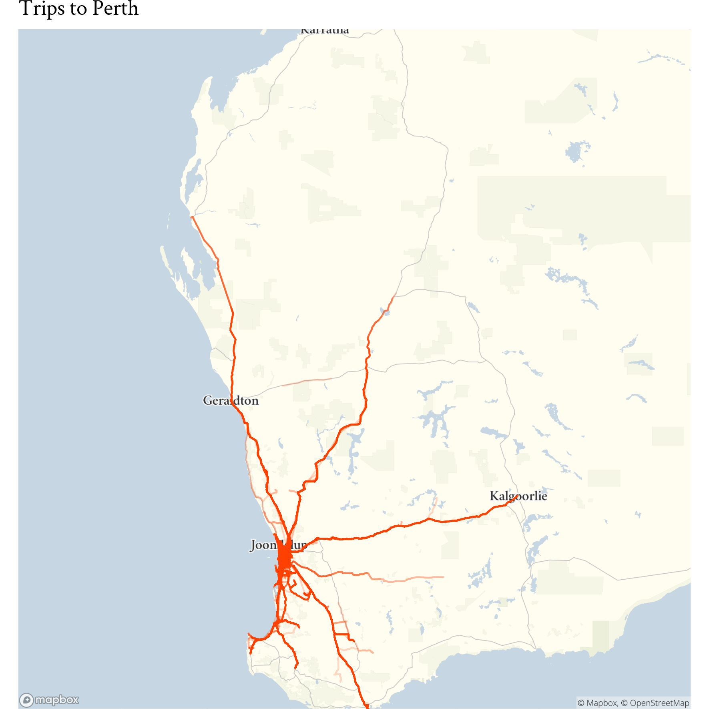

# A small sample of what we've done so far
There's a lot we can do with this data, but here's a small sample of what we've done so far, and a few ideas for more

## Routes and congestion{-}
One of our aims with this project was learning about the road network. Our road matching was on individual road segments, so that was our starting point. In particular road users and planners care about congestion, but what is congestion? Most people will answer something about too many vehicles or insufficient infrastructure but what they are mainly worried about the effects. One effect is slower speeds than are otherwise desirable; in our context that means deliveries take longer than they need to and increases costs for firms and their clients. The other effect is uncertainty; if you're unsure how long a delivery will take it makes it much harder to plan, and clients are unable to count on a delivery at an agreed time. Knowing the times and places where congestion delays and uncertainty happen not only helps planning by governments, but by firms and their clients who acn negotiate other times.

For any given segment we have a lot of observations, each with a speed and a time stamp. This means we can calculate the distribution of speeds by hour of the day, day of the week or any breakdown we want. There's also lots of statistics that we could use to convey the speed and uncertainty at any given time but we decided on two simple ones to make them accessible to everyone. The median speed (the midpoint of all the speed we observe) and the interquartile range (rang eof the middle 50 per cent of speeds)^[I may as well mention here that our map matching still provides the occasional error so we exclude any observations that exceed the speed limit or 100 kph, whichever is lower]. If the median speed is lower, speeds are generally lower. If the interquartile range is wider, it's less certain how long things will take. The below graph is an example from a segment heading west on the M5 in Sydney, snapped from our in house visualisation. The dark blue is the median speed, the light blue is the interquartile range. Speed and uncertainty are ok except in the early morning and when the motorway is shared with returning commuters in the afternoon and evening.

{width=100%}

The users of our data probably care more about whole journeys than individual segments. To get this we need to collate segment data together. If, say, we wanted to see how long it would take to travel on the M5 from the Hume Motorway to Port Botany in Sydney, we could select all the segments manually, but that would take a while and wouldn't help ad hoc inquiries. Luckily we could adapt the Open Source Routing Machine ([OSRM](http://project-osrm.org)) I mentioned in the map matching chapter. As long as we provided a start and end point ^[And occasionally some middle points if we needed to ensure a particular route] a minor tweak of the OSRM code meant we would be returned a list of the segments on the route ^[as an bonus this also made an easy way to fill in distances for observations we were unable to match with a path]. Here's the whole west bound route of the M5, animated.

{width=100%}

With these segments we could collate data and calculate travel times and uncertainty for the entire route. We'd have to make some assumptions, mainly that neighbouring segments had their slow days at the same time, but with median and 1st and 3rd quartile speeds, multiplied by the distance used on a segment, we have median and interquartile ranges for each hour of the day. Here's estimated travel times for the whole M5 in 2019.

{width=100%}

This worked great during the day, or on motorways where these was lots of data, but it could run into problems where data was more scarce. For some routes you might have a segment at 3am with no observations. Even if you had a small amount of data you ran the risk of outliers. A truck that spent most of its time at a traffic light between pings drags down the averages unless swamped by better data. As such, some routes were implausibly messy and volatile. We could just wait for more data to come in, but we might also want to track changes over shorter time periods, for instance comparing congestion week to week. 

In the end this problem was solved by the COVID-19 pandemic, because of two things. First I had to occupy myself whilst our IT systems caught up with working from home, and secondly there was suddenly a lot of interest in seeing the effect of a very sudden drop in commuter traffic on freight congestion. The former led me to finally learn the basics of Bayesian inference which, in crude terms, lets you use small amounts of data by adapting a reasonable prior belief. This, we realised, meant that with a prior like "the speeds on this segment are probably like the speeds of nearby segments at the same time" or "probably like the speeds of the same segment at other times", we could tweak that belief with the small amounts of data we do have to get reasonable estimates. Applied to the need to see the effects of lockdown resulted in [this paper](https://www.bitre.gov.au/publications/2020/freight-route-performance-under-covid-19) and graphs like this, estimates speeds even by hour by week, showing how travel time peaks were eliminated during initial lockdowns.

{width=100%}

Subsequently this blossomed into an [ongoing series of major reports on congestion in major Australian cities](https://www.bitre.gov.au/publications/2021/freight-vehicle-congestion-australias-five-major-cities-2019) (or alternately in gitbook form [here](https://bitre-telematics.github.io/Congestion_2019/index.html). You can find the code [here](https://github.com/BITRE-Telematics/Congestion).

## Freight data hub{-}

Our colleagues in the Department have also created the [National Freight Data Hub](https://datahub.freightaustralia.gov.au) which, along with other sources, uses our data on road segments and rest areas. This makes it easier for planners and drivers to estimate travel times on ad hoc routes, and to see where rest facilities are, how popular they are and the facilities they have.

## Port Maps{-}
As yet our data, whilst extensive, still comes from a limited number of firms. This makes it unwise to publish work on origin destination lest we betray information about our data providers and our clients, but we have still have developed techniques and have used the work internally. What we have published are reports on what we call the catchments of Australia's major city ports. Like maps of large river basins they show journeys draining into the ports.

{width=100%}

## Potential future work{-}
There's lots of other work we are keen to do, and work even on these existing products that we need to do. One thing we are keen to explore is "community detection". Our data is already in a graph database and one form of graph analysis discovers communities of nodes, for instance clusters of friends in a social network. But this can also be applied spatially, for instance [this paper](https://journals.plos.org/plosone/article?id=10.1371/journal.pone.0166083) determined a economic geography of the United States based on commutes in the Census, finding labour market regions that did not always aligned with administrative boundaries. Perhaps there is a freight geography of Australia that planners do not yet fully understand; community detection in our graph could help discover it.

But last, there's a major unanswered question. Why "Yulo"?
