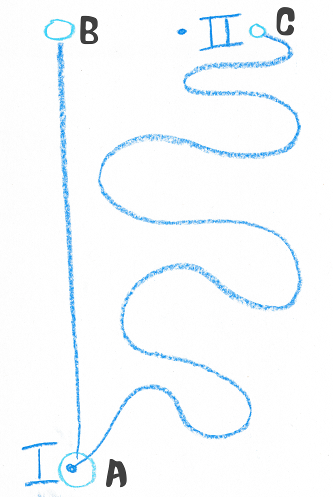

# What roads are they on?
If we were to find out how trucks are using the road, we need to know which roads they are using. In fact, we need to know where the roads are.
##Matching to what?
First we have to go on what seems like a digression but is pretty important to one's head around. What is a road and how do we get this idea of a road into a computer?

We don't usually think about this because we don't need to. A road is the thing vehicles go on, but the Romans built them long before cars and mainly used them for marching. They're made of tar, except when they're made of concrete or stone or, like a majority of Australia's roads, just of dirt. They are the place where only vehicles can go, except when they are shared zones. They're the only place vehicles can go, except garages and driveways and carparks are not roads...or are they? Roads are on the ground, but they also use bridges and tunnels. So what is a road?

For our purposes we are looking at transport of road freight. Freight is moving stuff from one point to another place. A road is a thing we use to move from one place to another by surface land transport, like trucks in our case. We're not really worried about roads as a place, just a way of going between two places. In fact between many places and many places. This is how we put our messy idea of roads into a computer. The road outside the building you are now in is a way of getting to the next intersection, and from there the next intersection or curve in the road, and so on and until one gets to the next suburb, the next city, the next state.

Most people would call this a network. Mathematicians like calling it a graph. We have a bunch of points connected by lines. The points (or nodes) are our places, the lines (or edges) are what connect them. They are our roads. They have no width, just a start and an end.

A very famous example comes from the 18th century mathemetician Leonhard Euler. He's how Wikipedia shows how he constructed a graph on his own city whilst attempting to solve the problem now known as the [Seven Bridges of Königsberg](https://en.wikipedia.org/wiki/Seven_Bridges_of_Königsberg). Each land mass is a node, and each bridge is an edge.^[Euler pioneered graph theory as a mathematical field but the basic idea is far older, for instance Gyoki style maps showing tribute routes to 13th century Kyoto (pictured) and even [songlines](https://www.smh.com.au/entertainment/tv-and-radio/songlines-20160606-gpc9y6.html) and [Marshall Island Stick Charts](https://en.wikipedia.org/wiki/Marshall_Islands_stick_chart). {width=100%}]

{width=100%}

There's a bunch of choices we make when we do abstractions like this. 

How many places do we have. If a road is windy and not straight we may want to add more points and more lines so we can see better where it goes and how long it is, but how precise we are is a choice, trading off precision to avoid a dataset that is too ungainly. Euler didn't care at all, but we do.
It'd be impractical for every edge between two nodes to be called a road by itself, lest every kink in a road creates a new road. So instead we group them together into string of nodes and edges. But how long are these groupings? Imagine you are at the shops in Newtown, in Sydney. What road are you on? Most people would say "King St", which goes from Broadway down to St Peters. But King St is also the Princes Highway, which keeps going to Kogarah, to Nowra, to Melbourne and all the way to Adelaide. That's far too long for our purposes, since what happens on King St doesn't affect Western Victoria, but even King St is too long if there is more traffic north of the intersection with Enmore Rd than South of it. So in the end these groupings are also choices about what seems practical and useful.

From now on, we will call these groupings "segments".

And that is our task, find out what segments the trucks in our data set are using.

## Which data{-}
So where do we get this data? It might seem strange but governments don't always have this right on hand already. After all, different levels of government manage different roads, and many roads aren't built by government. Different state governments may have their own data set, but most roads are local and many local councils just *know* where the roads are. Government, collectively, has this information, but not in a single data set.

But other organisations do need a single dataset, most notably many telematics and mapping firms. Such data is essential to businesses and they charge accordingly. But quite apart from the expense, what's the use of our data if it can only be used by others that are also able or prepapared to shell out these huge funds? It's also unclear how quickly we can get updates. Trucks will start using a motorway the moment it is opened, but is that in the data yet? And if there is a mistake, we might fix it for ourselves in our copy of the data but that doesn't help any other user of our data with the road data they paid for.

These proprietary data providers are also somewhat coy about how they collated their data, and I'm pretty sure I know why.

{width=100%}

OpenSteetMap (OSM) is like Wikipedia for spatial data, created and cuated by an open group of dedicated volunteers. But unlike Wikipedia, which is read by many people, most users of OSM don't know they are using it. It underlies many popular apps, whether providing public transport information or Pokemon Go, and is relied on by even the largest of firms. This is usally only obvious when things go wrong, for instance some unexpected results in Flight Simulator ^[See [this for instance](https://www.theguardian.com/games/2020/aug/21/melbourne-fawkner-suburbia-users-poke-fun-at-microsoft-flight-simulator-glitches)], made by Bing Map's owner Microsoft. I also suspect it was the reason for some unexpected nomenclature in Google Maps^[see [here](https://www.sbs.com.au/nitv/nitv-news/article/2017/06/08/evonne-goolagong-gets-her-own-arena-named-after-her-least-google-maps-least-now) and [here](https://www.couriermail.com.au/news/queensland/state-of-origin-legends-have-streets-named-after-them-in-juba-south-sudan-why/news-story/50d737a623d57604e90341b1f1b88a76)].

OSM data is free to everyone, which means if our data is matched to it, anyone can use it. If we find a mistake we can fix it, and the fix is there for everyone, and best of all, it gives us access to lots of open source tools for working with it.

## What method?{-}

So how do we match trucks to the segments. Remember from Part 2 that inevitable GPS error means observations are always jumping around with random noise. Moreover our road segments are one dimensional, even if the GPS was entirely accurate the trucks wouldn't be on the line unless they were in the middle of the road, which we hope they aren't!
The easiest method is just assuming they are on whichever segment is closest. This is called nearest neighbour matching. The computer takes segments within a given radius and checks which one is closest. Simple! But there are problems with this approach.

The first is random GPS error, often enough to put an observation closer to a side road, or to a road next to a motorway. That's obvious from the image of Southbank we saw in Part 2. We want something more accurate than that.

The second is even when it is accurate we only learn about the segment the truck was using when it pinged. We have data every 1 to 5 minutes; a truck may have used many segments in that time, but we only learn about one of them. You might think that with enough data you'd get information about every segment eventually but it's not that simple. 
{width=100%}

Obviously, as we noted earlier, some segments will never give us observations because they are in tunnels where the GPS until cannot hear the satellites. We still care about these,in fact they're usually incredibly important motorways. 

Less obviously this biases our sample towards slower vehicles. Imagine two vehicles, one fast and one slow, both reporting once a minute. The fast vehicle goes twice as fast as the slow. The fast vehicle uses 10 segments in a minute, and is recorded on one. The slow vehicle takes 2 minutes and reports twice. Two thirds of our observations for these segments are now from the slow vehicle. The real average speed is 75 per cent of the fast vehicle, but our data makes it looks like 66 per cent. This is a stylised example but the greater number of slower observations add up. Slower vehicles spend more time on any given segment, so they are more likely to be on it when they ping, and all our data gets biased. And that's when we have speed data anyway.

Ideally we'd use something else.
## Why Hidden Markov Map Matching?{-}
Think back to the South Melbourne map again. It's obvious to us that some of the points that are to the side of the motorway or on surface streets are really on the motorway, by *why* is it obvious. If we joined the dots in order it'd be even clearer. Trucks that are on the motorway are much more likely to have stayed on the motorway than to have left it via an offramp to get to a surface road that is close to the motorway. In short we are balancing the probabilities that the observation is on the right road with how probable it is that the truck would have taken the route necessary to get there. 

This is the core of Hidden Markov Map Matching (HMMM). We select candidates from segments near to the observation and calculate routes to each of them from the last observation. Segments closer to the observation are more likely, segments that have shorter routes on higher graded routes are also more likely. Our choice is the balance of the two. But how do we match the first observation? Well there we still have to use nearest neighbour.

For those who care this is why it is called Hidden Markov Map Matching. Like a Markov chain the probability of the next observation's location is a function of the last observation, but it is "hidden" because our first observation was an educated guess. And we match to a map.

In the diagram below we can see a vehicle has moved from observation I on segment A. It is now at II. It is closer to segment C, but the route to segment B is much more direct, so we conclude it is actually on B.
{width=100%}

Not only is this more accurate but we immediately get other benefits. Since we calculated the likely route we also know the road segments the vehicle used, even if it didn't ping on them, or if they were in a tunnel. Now we have data on all segments. We also have the length of the route and the time it took, which means we can calculate an average speed as well. This is great too because it isn't biased towards slower vehicles, and it better reflects travel experience than point estimates that can be zero (at a traffic light) or momentarily faster than average. Most importantly, this gives us speeds from the vast majority of vehicles for which we have no speed data.

## Why Barefoot?{-}
There's a cliche that the best code is the code you don't write yourself. In fact the framework for this book is a lightly reworked version of [Using R at Grattan](https://grattan.github.io/R_at_Grattan/), in turn built on open source tools. HMMM has many implementations but we needed to find one that would work for us at scale. In our search we stumbled across a repository on Github called Barefoot.

Now Barefoot wasn't created for our task. It was unconcerned with speeds and sampling. In fact it was fairly unconcerned about the actual road segment it matched to. Its main concern was correcting where the dot on an in car display was, so it actually was on a road, in real time. But doing that required testing and troubleshooting with batches of sample data, and recording road ids to check things were working fine. We could exploit the debugging tools for our ends.

We won't go in to too much detail on the work we needed to do on Barefoot, aided by the generous assistance of its authors and maintainers. But in short we started with a server, written in Java, that would take a stream of GPS pings from cars and return pings with lat lons that were on an OSM road network. We ended up with a Java server that would take whole trips of GPS pings and return.^[A very quick example of an adjustment was limiting the search area for candidate segments. The original parameters looked up to 50 metres which was fine when processing one observation every second, but we were passing thousands of observations in batches. Halving the search radius to 25 metres reduced the area searched (as per circle geometry) by 92 per cent, and this sped things up a great deal.]

* an OSM segment ID
* a list of OSM segment IDs used to reach that segment (where available)
* the distance traveled on the network to get to that segment
* the average speed experienced
* the direction traveled on each segment

##Further bogies 
We ran into other problems we didn't expect.

Some of these are related to a known problem with HMMM. Whilst the average error with HMMM is much less than nearest neighbour matching, when it does make an error it gets much worse quickly. Say HMMM mistakenly thinks a truck has turned off a motorway when it is still one. The next observation will likely be on the motorway. In that case the map matching might try to get the truck back on to the motorway by routing it to the nearest on ramp. Alternately it might deem this too unlikely and decide the next observation is in error and the truck is still on a side road. In either case the route is longer than the one the truck actually took so it appears that the truck is going *very* fast. And from then, if it has decided the truck is not on the motorway, it'll do the same process again, and again, with errors getting larger until it decides all options are too improbable and starts again.

Fortunately this is relatively rare and can be managed with judiciously managed parameters. 

Or so we thought. We ran into two unexpected problems.

Data from one firm in particular was giving us problems. Very often, when trucks from this firm were travelling along motorways Barefoot would determine they were jumping from small residential surface street to small residential surface street, tearing in and out of cul de sacs at high speed and only rarely returning to the motorway. Why did Barefoot think this was more likely than the motorway. Indeed when we looked at the raw data each offending observation was closer to the side streets than the motorway, but the algorithm was meant to account for this. But they weren't just closer to the side streets, they were right on it. And not just right on the area of the street but on the two dimensional line representing the street in the data. That precise placement is extremely unlikely in even perfectly accurate data, unless they were driving in the middle of the road. What had clearly happened was at some point the telematics provider for this firm had already matched the data to the nearest neighbour and "corrected" the pings. By the time Barefoot saw the data it had to weight the unliklihood of the route against the unlikelihood it wasn't on the street which it appeared to be perfectly placed.

To be honest we never solved this problem. The firm providing the data had started providing it in a different form that wasn't pre matched, although they were unaware of any pre matching that had happened before, so we never had to deal with it.

The second unexpected problem looked similar but was quite different. Instead of a single firm's trucks being mistakenly taken off motorways all over the country, every firm's trucks were being taken off some particular stretches of motorway. We first noticed this on Southern Cross Drive in Brisbane. Barefoot would, without fail, route the vehicles onto an off ramp and onto surface streets. It wasn't that it didn't know the next observation was on the motorway, in fact most of the time it came back on to the motorway at another on ramp to get close to the recorded position, even it it mean travelling in the reverse position. For whatever reason, Barefoot simply didn't know the trucks could just keep going along the motorway. But why? The road segments were connected after all, and the one way direction was correct. Furthermore it wasn't just a Barefoot error. If we used the Open Source Routing Machine ^[written in c not Java] that is into OSM's online display and asked for directions it would also route us off. We asked on the forums but other users, though helpful, were also baffled. Eventually, comparing offramps that were mistakenly taken and those that weren't led us to a revelation. All the ones that worked were marked with a node labelled "motorway junction". All those that didn't work were just a plain, unlabelled node. It seems what happens is this:

* Motorway segments have the attribute "motorway". Motorway on and off ramps have the attribute "motorway_link"
* If a motorway_link is connected to a motorway the node where they connect must be marked "motorway junction" as in the image on the left.
* If it is not labelled motorway junction (as on the right) a routing graph built from this data will deem the motorway only connected to the motorway_link and not the continuing motorway.

{width=100%}

As far as we can tell this wasn't documented anywhere, but it was easy to fix, and not just for ourselves but for all users of Australian OSM data. Fortunately it only applied to segments of "motorway" and "motorway_link" and not, say, to "primary" and "primary_link" so we spent an afternoon travelling along every stretch of motorway in Australia. In Sydney one user had systematically labelled each node **just before** each off ramp as a motorway junction instead of the one at the off ramp. Apparently they had, not foolishly, assumed the node label indicated where the turn off sign was!

We had one other unexpected problem. Barefoot's designers were all too aware of broad category of problems we faced here - exponential error from wrong decisions and disconnected road systems due to map data error - and had built in safeguards. Barefoot would stop investigating a particular route if it exceeded a certain threshold, say 15km. This means that, if the road network was disconnected from the correct road, or the routing had departed the true route before, or even if the truck has genuinely left the road network the engine would not futilely search the entire country for a way there, which would take up resources to no end. Instead it would just give an error when no route was found. Barefoot is designed for tracking vehicles providing data every few seconds so this isn't a big deal, but were are using it to do batches of data reporting a position every minute or so. This caused some problems. Imagine a vehicle in South Western Sydney. It leaves a deport and heads South on the Hume Highway towards Canberra. But for whatever reason its GPS unit has conked out for 10 minutes. By the time it come back online the truck has travelled 10 minutes at 100km per hour, or nearly 17km. Barefoot tries the correct route, but stops at 15km and tries every other route within 15km of the depot, and then reports an error. We end up with no map matching for the trip, but it also took a lot of time and computation to get that error. We could increase the threshold to 20km, but that just means we still have the same problem when the system conks out for 15 minutes, and it would take even longer to get that error. It'd also take longer when the other kinds of problem arise.

Our solution was fairly simple as a result. If we had a big time gap in a trip, we'd split it before giving it to Barefoot, and joing it back together later. We wouldn't get speed or road data for that time, but averaging over 10 or 15 minutes likely wouldn't tell us much about individual segments anyway. We'd still likely want to know the distance travelled, but we could impute that from our own instance of the Open Source Routing Machine, which I will discuss later.

So now we have a bunch of stops and a bunch of trips, the road segments used on those trips, and the speed they went. It's a lot of data, how do we handle it? But first, there'sa bunch of other miscellaneous processing I'd like to talk about.
