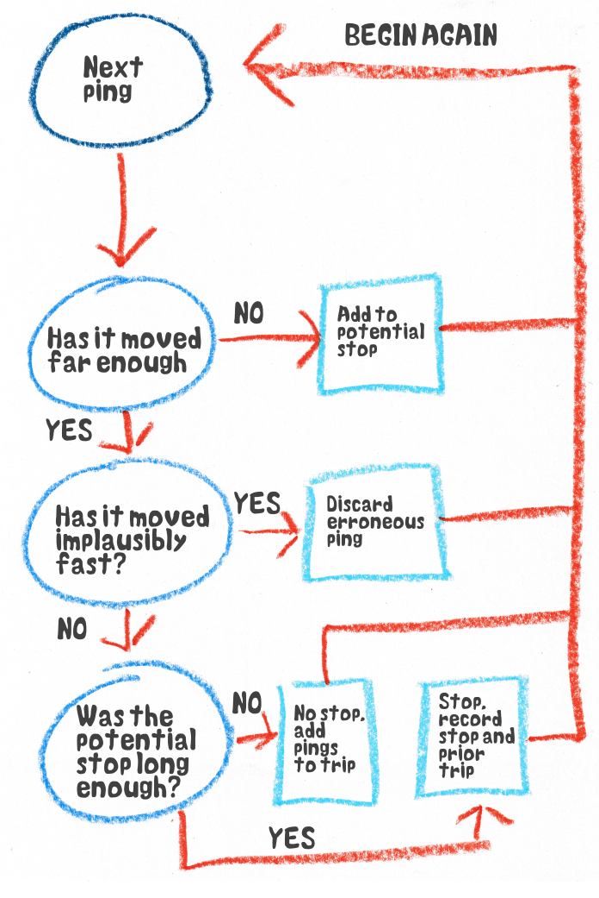

# Trips and stops
The first step must be cleaning the data, right? Garbage in, garbage out; if we start working with highly flawed data we won't get any good results. So we've got to get rid of those erroneous jumps to the middle of Moreton Bay, and that loitering at the entrance to tunnels. Then we can get to work working out what they are really doing.

But how do we do that? Why are these errors so obvious? 

The jumps into the forest and sea are easy to realise are false, we could simply filter out all those areas. Except if there is a road through the forest, or a car ferry, and we haven't started matching to roads yet so how would we know? Anyway, some of the jumps might be into other parts of the urban area, or even on to other roads. The real give away is they are moving too quickly, even if there was a straight highway out to Moreton bay they couldn't go dozens of kilometres in a minute. We're really making inferences about what we assume is reasonable behaviour, which is also what we're going to do to work out what the trucks are doing. So maybe we can combine the two.

Our goals are three things about the trucks. Activity, which is going from origins (where they stop) to a destination (where they stop). Information about the road network, which they use when they are not stopped, and stops which, uh, is where they stop.

You may have noticed a theme here. A truck is either stopped or not stopped, and most of our subsequent analysis relies on that distinction. It also matters a great deal for our use of resources; we don't want to match a lot of observations of stationary vehicles to the road network.

## Options{-}

In short we needed to find stops. Everything that wasn't a stop was a trip.

Our first attempt to see if trucks were stopped used the speed variable some firms provided. Most firms didn't provide this, but it was a start. A stopped truck has a value of 0 right? But the results weren't encouraging. A lot of the time it looked like trucks were stopped on the road, and other times they would loiter around a rest stop with low speeds (around 5kph) for 20 minutes or more. The speed variable wasn't just limited to a portion of the data, it seemed to be a little messy. And anyway, what if a truck was in a depot, then moved to the other side to pick something up and we got a ping whilst it was moving. Normally we'd consider everything in the depot a stop, but the speed variable would pick up a trip.

We also briefly considered whether we should just take series of observations in the vicinity of a known location as stops. If observations were loitering around a rest stop, or supermarket, or depot it was likely stopped there. But where do we get all those locations from? And how do we keep any list up to date when the freight environment changes all the time, and businessed open close constantly. Moreover one of our major concerns was where drivers were using informal rest areas instead of of formal ones. We'd have to know the location before we knew it. Instead we needed an "unsupervised" approach, that could find stop locations it didn't already know about.

Eventually we stumbled across a Belgian paper that was also concerned with grouping GPS traces into trips and stops. They weren't concerned with trucks or even vehicles, but with creating prompts for activity surveys; by noting a stop at one location the person filling out the survey might remember what they were doing. But we could adapt their methodology fairly easily^[as I was writing this I found [other Belgian researchers](https://www.sciencedirect.com/science/article/abs/pii/S0966692321000302?casa_token=MTq3V4qfOuEAAAAA:XqAZEG94KdSkeg5ik5QZV_i5f6Ql5VVl_sIL1sqiejBCRJohC4CBi6PGRNmUIlSekBKxSQj3JmHc) who had applied the same paper to road freight. Great minds.]. 

Their approach was based around clustering. A stop was just when the trace stayed within a given radius for a given time.

We start with the first observation. We'll provisionally put this in a stop for now.

Now we look at the next stop and see how far away it is. If it is within our given radius it is still a provisional stop, so we add this point to it as well, and we calculate a centroid, or average position of the stop, from these points. This is what we compare the next observations to. Also, if it is exactly the same as the last point it's one of the repeated observations, so we just chuck it.

We keep doing this until we reach an observation that has moved outside the radius. Maybe this was the end of a stop. But first we do a quick check of the "crow flies" speed. If it is something ridiculous we know it was one of the erroneous jumps, so we chuck it and move to the next one. If it seems legit, we turn our attention to the provisional stop points. If they cover a given amount of time, we have our first stop. We record the start time, end time and centroid, and everything else can get tossed. The new observation, and the last one (for reasons I will cover later) are added to a provisional trip.
{width=100%}

If the provisional stop *isn't* long enough, then all the observations are added to the last provisional trip. If the truck was moving prior to the provisional stop event there will already be observations there.

As such, every time we confirm the end of a trip event, we have a trip stop pair; the summary data of the stop, and all the observations leading up to the stop, and we can record these.

There is a potential bogey case however. Imagine a truck in a depot that stops on one side of the property. Its GPS unit doesn't ping when the ignition is off so we only have 2 or so in the stop event and, due to random GPS error, both those pace it over the fence. Then it moves over to the other side of the property to get loaded. It's quite possible we end up with two stops on either side of the depot, with a "trip" with one or two observations in between. In that case we'd reasonably call that a single stop. So we can do a check to see if stops are sufficiently close in time and space and, if they are, combine them whilst discarding the trip in between.

Incidentally we need to give unique IDs to these trips and stops. We could number them in order for each vehicle, but what if we get earlier data? We could have a universal list but that's another thing to maintain. Instead we can just exploit the fact vehicles can only be in one place at a time. The id for each trip and stop is the vehicle ID with the time it starts, in hexidecimal, stuck on the end.

## Does it work{-}

Seemingly yes! When we first tried this on sample data we spent a great deal of time looking at stops to spot any bogeys. Most were at light industrial areas or rest areas on highways, but there were quite a few that looked less obvious. I found a cluster in the mountains just west of the Central Coast, but satellite imagry showed a cleared area next to powerlines with trucks visible, presumably with materials for repair and maintenance. Another was opposite a service station on the Federal Highway leading into Canberra, but (repeated) physical observation let us see trucks parked under a shady tree by the road. There was a cluster on a remote highway in Western Australia, and Google Street View imagery and aerial photography showed no trucks, no tyre marks and nowhere to even park between the road and the scrub, but afterwards newer imagery showed a freshly built rest area. 

Things appeared to work well, we had ordered our data, and cleaned it at the same time. Moreover, we were finding locations even without knowing about them before hand. Things made sense.

## A note on parameters{-}

This whole process requires parameters. How long is a stop? How big is a reasonable stop area? How fast is too fast for a jump to be considered valid? How close in time and space do stops need to be to be considered a single stop. There are others as well. How do we choose these?

The honest answer...it depends.

We are concerned entirely with freight, and have relatively low resolution of data. The stops we care about entail rest breaks and the loading and unloading of freight, which usually imply a longer time, so we settled on a threshold of 15 minutes. Given we only have one ping every 1 to 5 minutes a lower resolution probably wasn't feasible anyway. We'd lose some hurried toilet breaks, quick refueling and incredibly efficient loading and unloading^[on this point where such efficient loading exists, such at ports, the trucks are usually waiting in a queue anyway] but we'd have to live with that.

But people who adapted this to other uses, such as public transport or pedestrian traffic would have to make other choices, and probably face a tradeoff between getting short stops and avoiding spurious "stops" at traffic lights or in congestion. 

Over all, choosing a shorter stop duration also means faster processing down the line. The shorter the stop duration, the more stops you get and the more observations are in stops. The more observations in stops the more stops can be discarded instead of matched to the map.

## Implementation{-}

Unlike map matching (which we'll cover in the next part) there was no existing code for us to adapt. We had to do it ourselves from scratch. We're economists by training, not programmers, so we started in what we knew, which was R, a language made for statistics. This was enough to confirm hat the process worked, but it was slow and R really wasn't the tool for the job. It's very good for analysis and statistics but not for doing large scale tasks regularly, and even then we were expecting hundreds of millions of observations. 

We tried Python which is also popular for statistical work, but also runs services in production, but it was also slow, taking about a minute to process a whole vehicle. On a lark I tried rewriting the Python code in a different style [^away from for loops to map and reduces, broadly from imperative to functional] and this unexpectedly reduced processing times by two thirds, but it was still too slow. Both R and Python were scripting languages, easy to write on the fly but slower to run. Great for ad hoc tasks but not for ongoing work. We needed a compiled language instead.

Usually when you have an ongoing task in R or Python that is slow you implement that particular thing in a compiled language, like C++, and call in in R or Python with a tool like Rcpp, but we decided against that. After all this was only one part of our process, we might as well make as much of our process in one program. There are many popular compiled languages, such a C and its family, and Java which our map matching was coded in (see the next chapter). Eventually we went with Go, for one main reason. Every one of our vehicles could be processed independently, what happened to one was irrelevant to the rest. This, in computing jargon, made our work "embarrassingly parallel", which work could be split between processors in a CPU and be done at the same time. Go is designed to make this part easy.

As such our tripgrouping could be incorporated into a larger program that co-ordinated the Yulo process, including interacting with our map matching server, which is in the next chapter.
