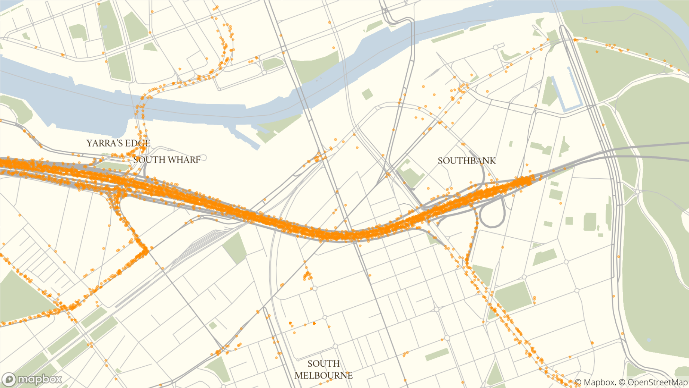
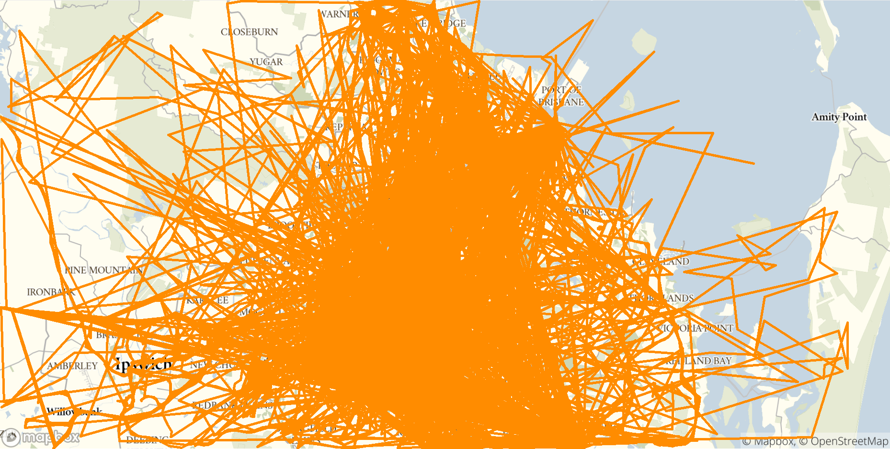

# The raw stuff

## Where does the data come from, and why?{-}
Our data come from private firms, some smaller, some larger. They give us the data because they think they can benefit. They can benefit from better investment in roads and stops. They can benefit from seeing how their activity compares to the industry as a whole. They can benefit by being able to plan their own journeys at different times and on different routes. But they also need to trust us that it won't be used for anything else, and that we will respect their privacy. We are very keen to maintain that trust. 

## What does it look like{-}
We get data in a bunch of formats, including xml, json and csv but when it comes down to it telematics data is just a long list of observations. Each device pings every so often reporting "I am here at this time". A longitude, a latitude, a time and an id. That's it. Sometimes we might get some other things like a speedometer reading or even a compass direction (with we call an azimuth) but not usually. Turning this long list of pings into information about the freight network is not obvious.

```
## Warning: package 'knitr' was built under R version 4.1.2
```

```
## Warning: package 'readr' was built under R version 4.1.2
```

\begin{table}

\caption{(\#tab:dataFrames)Sample unprocessed data}
\centering
\begin{tabular}[t]{r|r|r|l|l}
\hline
Vehicle & Longitude & Latitude & Firm & datetime\\
\hline
54 & 152.9470 & -27.56354 & Yellow & 2016-05-23 13:47:58\\
\hline
64 & 153.1452 & -27.42933 & Yellow & 2016-05-06 10:32:03\\
\hline
701 & 153.1655 & -27.42031 & Yellow & 2016-05-30 16:24:07\\
\hline
937 & 153.1129 & -27.46629 & Yellow & 2016-05-23 11:15:36\\
\hline
966 & 153.0080 & -27.33093 & Yellow & 2016-05-16 13:00:33\\
\hline
\end{tabular}
\end{table}

But first, lets just have a closer look at these pings and we notice some stuff that is funny even before we start.

## GPS error{-}

Here is the South Bank of Melbourne, and each dot is an observation. It's pretty obvious that most are on the motorway. But some are on the shoulder, some even in the wall and some inside buildings. This clearly isn't right, but GPS measurement error is a fact of life. Most of the time it is fine, but sometimes we need to account for the truck that says it is in a building when it is on the road. 

{width=100%}

## Repeated observations{-}

When we first looked at the data we'd occasionally note trucks that just...stopped. It wasn't just that they were in the same place, they were in **exactly** the same place. A truck that has stopped usually looks like it is moving around just a little bit because of GPS error, but these were in the same place, to 5-6 decimal places, for minutes on end. Moreover they were doing this in the middle of the road, which didn't seem to be likely. In particular we noted them in places like the map above, at the mouth of the CityLink tunnel. GPS devices work by listening to satellites constantly shouting out where they are, but in a tunnel those satellites cannot be heard, so the GPS devices didn't know where they were. Unable to create a correct location, sometimes they would gave a error but other times they would just report the last place they were sure they had been, at the mouth of the tunnel. Subsequently, after a good time apparently loitering at the entrance of the tunnel, they would abruptly appear at the exit. Whatever we did would need to account for what happened in the tunnel even if the GPS couldn't tell us directly.

## Weirder errors{-}

Lastly, have a look at this group of traces (observations linked together in order) in Brisbane. It's very easy to see the outlines of motorways and other main roads, but something is definitely off. I think it is reasonable to suspect vehicles did not teleport, or fly or otherwise travel from Brisbane into the bush or Moreton Bay and back in minutes. For whatever reason this firm, although most of its data was fine, occasionally threw in complete bogies which we would need to account for. In our broader data set we sometimes saw vehicles jump well into the Pacific ocean or into Indonesia as well.

{width=100%}

So let's get to work.
