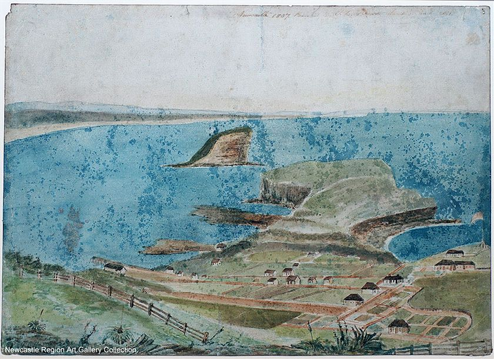

# Why Yulo

Our project is known, rather straightforwardly, as The BITRE Freight Telematics Program. But our framework, and code, is called Yulo. Why?

When I was examining some early results to make sure they made sense I happened to look at Watt St in Newcastle, NSW. Watt St is often described as "Newcastle's first street", it was a track already when Europeans first used it in 1804, having been used for untold centuries by the Awabakal people. Watt St is not the only part of our road network that predates Europeans and tar and concrete. One of the first things convicts of the First Fleet attempted after landing on Australian soil was to take paths they found to the ships of La Perouse moored in Botany Bay; those paths are now Anzac Parade, and large parts of our regional highway network are said to be based on the routes first taken by Europeans reliant on Aboriginal guides.

This highlighted the point made in the map matching chapter, our work did not consider roads as places or of things made of tar and concrete, but as ways from A to B, paths between two places.

Out of curiosity decided to see what "path" was in Awabakal. One dictionary I found said "yulo". Another dictionary said "yulo" meant "foot". The feet that first made Watt St were undoubtedly bare, and now we were matching GPS pings to it with Barefoot. It seemed an appropriate name.
{width=100%}

This is the logo we made for Yulo. It is a stylised representation of a path from every SA2 region in Australia to Alice Springs, derived using OSRM. Paths flowing to and from every part of the country.

{width=100%}
